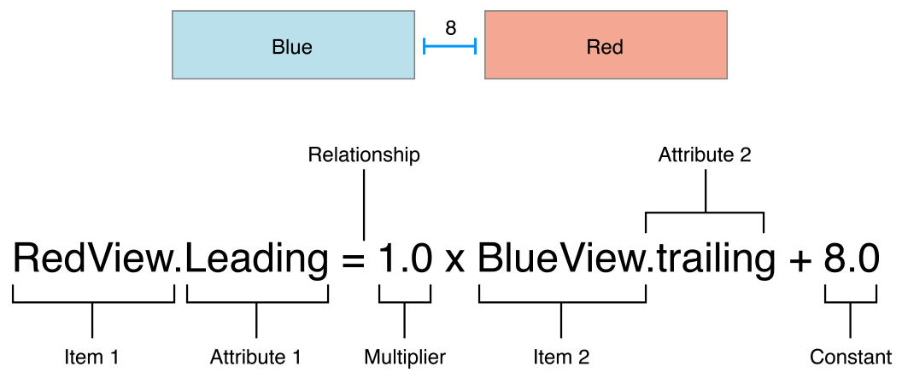

# Textual Auto Layout


[](LICENSE)

Textual Auto Layout (TAL) helps you create Auto Layout constraints that you can read, understand, and maintain.

In contrast to existing libraries ([SnapKit](https://github.com/SnapKit/SnapKit), [Cartography](https://github.com/robb/Cartography)), TAL follows a minimization approach. The package consists of a single ~150 lines source file, thus TAL won't have every imaginable feature. Instead you get a dependency ideal for security audits: short and tidy.

To install, use Swift Package Manager or simply copy the source file to your project and you're good to go.


## Requirements

- macOS 10.11+ / iOS 9.0+ / tvOS 9.0+
- Swift 5? (probably lower, can't test)

The swift package requires `swift-tools-version:5.0` for the new `platforms` attribute.


## Long story

Lets take a look to Apples documentation archive on Auto Layout Guide, [Anatomy of a Constraint][1]. There is a wonderful picture that illustrates the constraint relation between two views.

> 
> Copyright © 2018 Apple Inc ([source][2])

I love the simplicity of the depiction. However, when you start creating constraints programmatically, the same constraint looks more like this:

```swift
let constraint = RedView.leadingAnchor.constraint(equalTo: BlueView.trailingAnchor, constant: 8.0)
constraint.isActive = true
```

Not only is this hard to read but it gets tedious when you have to create a bunch of constraints (and remember to activate all of them).  
**Textual Auto Layout** (TAL) to the rescue; This is what the same constraint looks like in TAL:

```swift
RedView.leadingAnchor =&= BlueView.trailingAnchor + 8.0
```

This sets all constraint attributes and activates the constraint too. The only slight deviation to the illustration it uses `=&=` instead of `=`.

There are two reasons for that. The obvious, `=` is already used for assignments. But also, you want to handle the other relations too. You have the `greaterThanOrEqualTo` and `lessThanOrEqualTo` relations at your disposal (`=>=` and `=<=` respectively).


### Going into a different dimension

The example above uses a multiplier of `1.0`. Technically this is correct, though it does not make sense for location attributes. The documentation is clear:

> You cannot use a nonidentity multiplier (a value other than 1.0) with location attributes.

Thats why it is omitted altogether in the `=&=` relation above. But lets take a look where it does make sense, dimensional constraints:

```swift
View.widthAnchor =>= 2 * View.heightAnchor
View.widthAnchor =<= 250
```

These two constraints ensure that the view is at least twice as wide as tall, but at most 250 pt wide. Readability, 100%.  
Again, what would you do without TAL?:

```swift
View.widthAnchor.constraint(greaterThanOrEqualTo: View.heightAnchor, multiplier: 2).isActive = true
View.widthAnchor.constraint(lessThanOrEqualToConstant: 250).isActive = true
```


### Prioritize your constraints

Sometimes requiring a specific is just too strong. You can adjust the priority in the same line. Use the pipe symbol (`|`)<a href="#n1" id="n1ref"><sup>1</sup></a> and append the priority as needed:

```swift
View.widthAnchor =&= 250 | .defaultHigh
```

--------------------
<a id="n1" href="#n1ref"><sup>1</sup></a> To be consistent with Apple documentation, I'd like to use `@` for priority assignment (instead of `|`). But sadly you can't use `@` in an operator declaration.


### Doing more things at the same time

Usually you need to set more than a single constraint. For example, you want to set a child view to the same size as the parent view, but inset by 5 px in all directions. You could create these four constraints individually, or use a little helper method:

```swift
Child.anchor([.top, .bottom, .left, .right], to: Parent, padding: 5)
```

The `anchor(_,to:)` method will use the same relation attribute for both views. In this example the code above is equivalent to:

```swift
Child.topAnchor =&= Parent.topAnchor + 5
Child.leftAnchor =&= Parent.leftAnchor + 5
Parent.bottomAnchor =&= Child.bottomAnchor + 5
Parent.rightAnchor =&= Child.rightAnchor + 5
Child.translatesAutoresizingMaskIntoConstraints = false
```

Notice how `bottomAnchor` and `rightAnchor` did change the relation direction instead of using `Child =&= Parent - 5` with a negative constant. This makes it easier when debugging constraints. You can simply look for your chosen `5 px` padding instead of thinking what edges are involved.

Further you should note that `anchor(_,to:)` will set `translatesAutoresizingMaskIntoConstraints` to `false`. Most of the time you'll want that. In fact you'll probably want to set it for single constraints too. But give it some time and you'll see that you often use both constraint types at the same time.

```swift
ChildA.anchor([.leadingMargin, .trailingMargin], to: Parent)
ChildB.anchor([.leadingMargin, .trailingMargin], to: Parent)
ChildB.topAnchor =&= ChildA.bottomAnchor + 8
```

In that case both relevant views (`ChildA` and `ChildB`) have `translatesAutoresizingMaskIntoConstraints` set. Not `Parent` though, which is intended. E.g., `Parent ` may have `autoresizingMask = [.flexibleWidth, .flexibleHeight]`.


#### Limitations

Since the `anchor(_,to:)` reuses the same relation attribute for both sides, you can't connect two different attributes (e.g., `.left =&= .right`). You can resolve this issue with individual constraints.


### Requiring greater control

Even though it wasn't mentioned in the previous example, you can chain `anchor(_,to:)` with a priority, same as with individual constraints. Or more general, the `anchor` method returns a list of constraints. And you can apply functions on constraint lists.

```swift
let x: [NSLayoutConstraint]
x = Child.anchor([.left, .right], to: Parent)
x | .defaultLow
// or short
Child.anchor([.left, .right], to: Parent) | .defaultLow
```

It doesn't stop there. I haven't mention it in the beginning, but every TAL expression has a return type.

```swift
View.widthAnchor =<= 250 // returns NSLayoutConstraint
```

This allows you to chain, reuse or store constraints for later usage.

```swift
let compactConstraints = [
	View.widthAnchor =&= 120,
	View.heightAnchor =&= 35
].setActive(false)
let regularConstraints = [
	View.widthAnchor =<= 250,
	View.heightAnchor =<= 50
] // implicitly isActive = true
regularConstraints | .fittingSizeLevel
```

And lastly, though not as helpful as the other features. You can constraint the intrinsic content size.

```swift
Label.constrainHuggingCompression(.vertical, .required)
// which is equivalent to:
Label.setContentHuggingPriority(.vertical, for: .required)
Label.setContentCompressionResistancePriority(.vertical, for: .required)
```


[1]: https://developer.apple.com/library/archive/documentation/UserExperience/Conceptual/AutolayoutPG/AnatomyofaConstraint.html
[2]: https://developer.apple.com/library/archive/documentation/UserExperience/Conceptual/AutolayoutPG/Art/view_formula_2x.png
